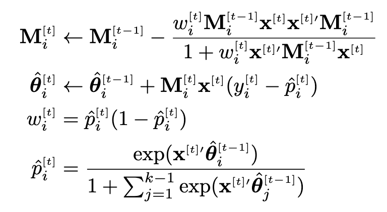
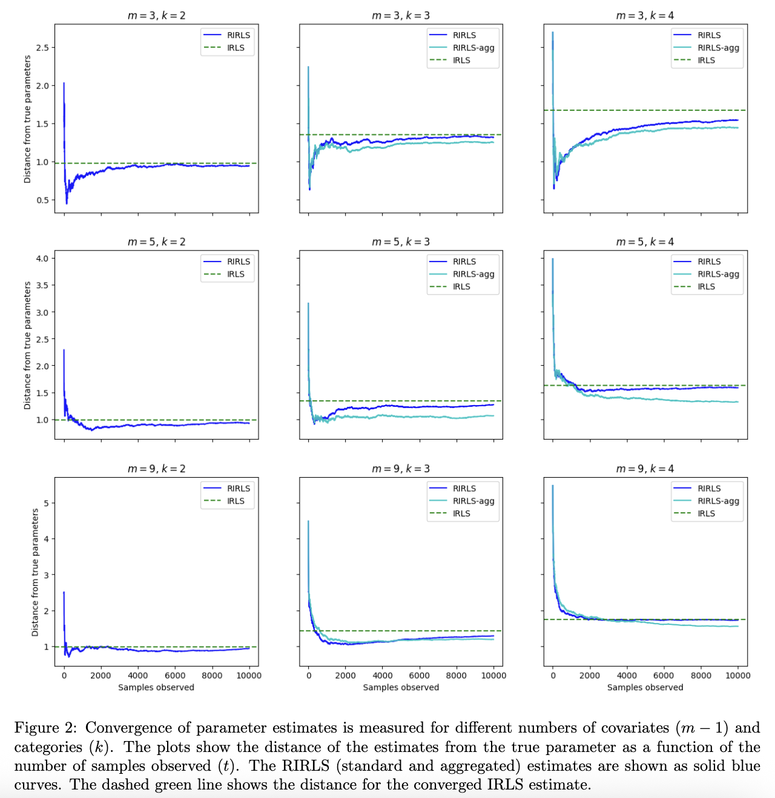
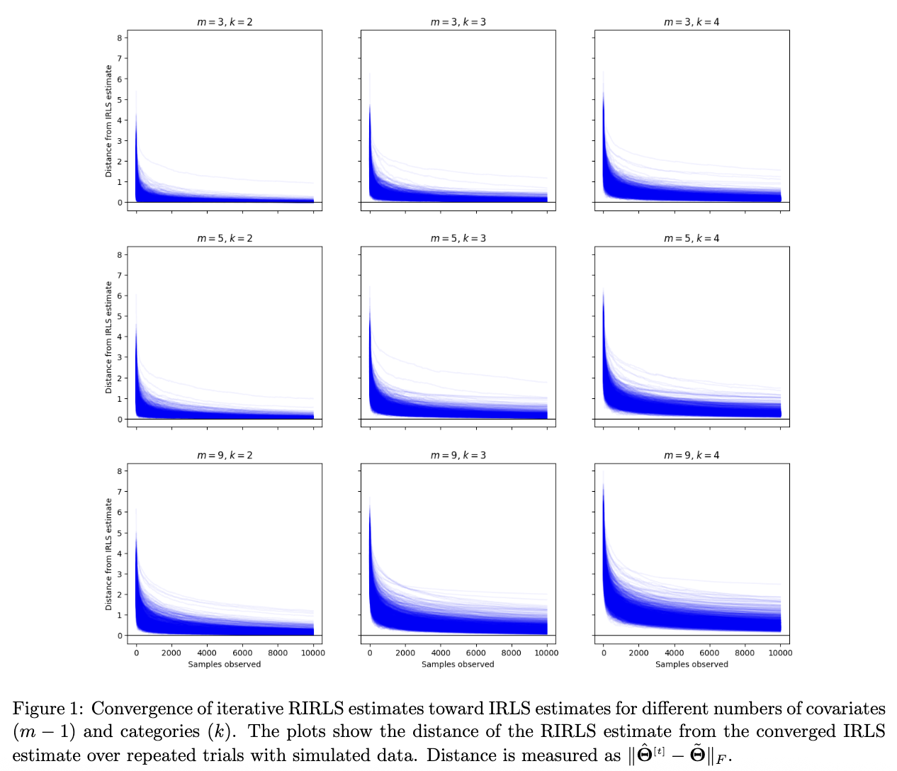

# Recursive Iteratively Reweighted Least Squares (RIRLS)

This project implements an algorithm to recursively estimate (multinomial) logistic regression coefficients with online/streaming data. The algorithm, referred to as RIRLS, integrates Recursive Least Squares (RLS) and Iteratively Reweighted Least Squares (IRLS) methods.

The algorithm maintains a set of inverse weighted covariance matrices $\{\mathbf{M}_i\}$ and parameter matrix $\mathbf{\Theta}$. The updating rules for each are:

    

Preliminary experiments suggest that RIRLS converges to IRLS:

  
  

See the [write-up](write-up.pdf) for full technical details. The algorithm implemented in `src.estim.rec_irls` and `src.estim.rec_irls_agg`.
